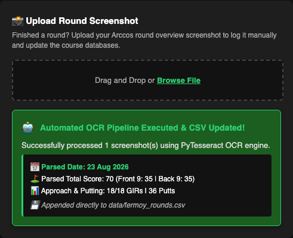
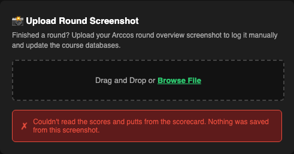

# DEF-001: Unreadable scorecard uploads are saved as made-up rounds and overwrite real data

| | |
|---|---|
| **Status** | Fixed in `5360c85` |
| **Severity** | High: silent data loss, reported to the user as success |
| **Component** | OCR screenshot upload: `parse_and_append_round_ocr()` and `display_upload_success()` in `golf_app_v8.py` |
| **Found** | 2026-09-23, while fixing a false-passing unit test (see [How it was found](#how-it-was-found)) |
| **Reproducible at** | tag `demo/ocr-silent-overwrite` (commit `5ccce1b`) |
| **Environment** | macOS, Python 3.12, Tesseract 5.5.3, Chromium (Playwright) |

## Summary

When OCR can't read a scorecard screenshot's Score or Putts rows, the upload pipeline makes up the missing data: par on every hole, 2 putts per hole, and today's date if no date was found. It saves that as a round and shows a green success message. The pipeline replaces any existing round with the same date, so uploading a real screenshot that OCR can't read **overwrites the real round with a fabricated one**.

## Steps to reproduce

```bash
git checkout demo/ocr-silent-overwrite
python golf_app_v8.py
```

1. Open http://127.0.0.1:8050. The Round Analysis tab is the default.
2. In **Upload Round Screenshot**, upload `data/round_captures/fermoy-23-aug-26.png`.
3. Look at the row for `2026-08-23` in `data/fermoy_rounds.csv`.

> This modifies `data/fermoy_rounds.csv`. Restore it afterwards with `git checkout -- data/fermoy_rounds.csv`.

Or reproduce through the tests: at the tag, `pytest test_golf_app_v8.py` gives **4 failed, 15 passed**.

## Expected

The upload is rejected with an error explaining what couldn't be read. Nothing is written, and the existing 23 Aug round stays as it is.

## Actual

The upload banner reports success with a par round the screenshot doesn't contain:



The real round in `data/fermoy_rounds.csv` is replaced:

| | Date | TotalScore | FrontScore | BackScore | Total_Score | Front9 | Back9 |
|---|---|---|---|---|---|---|---|
| **Before upload** | 2026-08-23 | 82 | 47 | 35 | 82 | 47 | 35 |
| **After upload** | 2026-08-23 | *(blank)* | *(blank)* | *(blank)* | 70 | 35 | 35 |

Per-hole data is overwritten too. For example, hole 10 (a real birdie 3) becomes a par 4.

## Root cause

In `parse_and_append_round_ocr()`, at the tagged commit:

1. **Par fallback:** if no 18-hole Score row was found, `scores = fermoy_pars`. If no Putts row was found, `putts = [2] * 18`.
2. **"Any row" fallback:** before that, if no line labelled Score was found, the first line with 18–21 numbers (the first 9 between 1 and 12) was used as the scores. The Hole-number row matches this, which produced a saved round of **171**.
3. **Date fallback:** if no date was found, it used today's date.
4. **Replace by date:** before appending, any existing row with the same date is removed. Together with (1) to (3), this turned "couldn't read the screenshot" into "delete the real round."
5. **UI:** the error branch of `display_upload_success()` showed a green "✓ Uploaded N round screenshot(s) successfully! Telemetry logged to database." even when parsing failed outright.

### Why the tests didn't catch it

- `test_parse_and_append_round_ocr_pipeline` used a synthetic scorecard drawn in Pillow's tiny default font, which Tesseract can't read. The scorecard was also exactly par (70: 35/35), so the par fallback produced the "expected" answer and the test passed without OCR reading anything (fixed in `e68e00e`).
- `test_display_upload_success_callback` passed a truncated, invalid image and asserted the green success banner. **The test enforced the bug.**
- `test_load_fermoy_rounds_csv_integration` accepted 70/35/35 as valid values for the real 23 Aug round, which is exactly the fabricated par round.

## How it was found

1. The OCR unit test was writing a row to the real `data/fermoy_rounds.csv` on every run. While isolating it to a temp copy (`f752b46`), a new assertion on the saved date failed.
2. Checking why showed that Tesseract was reading almost nothing from the test image ("Score" came out as "soore"), yet the test's score assertions still passed. The parser was falling back to par, and the test card *was* par. That was a false pass (fixed in `e68e00e`).
3. That raised the question of what the app does with **real** screenshots it can't read. Running the three real captures through the parser: both Fermoy screenshots fell back to par, and only Mt Wolseley parsed correctly.
4. Replaying the 23 Aug upload against a copy of the real CSV confirmed the overwrite (82 → 70).

## Fix

- **Red** `5ccce1b` (tag `demo/ocr-silent-overwrite`): tests describing the correct behaviour, all failing against the current app.
- **Green** `5360c85`: `parse_and_append_round_ocr()` returns an error naming what it couldn't read (date, scores and/or putts) and saves nothing. The par, 2-putt, "any row" and today's-date fallbacks are removed. The upload banner shows failures in red.



Real screenshots after the fix: both Fermoy captures are rejected with "Couldn't read the scores and putts from the scorecard." Mt Wolseley still parses (94: 45/49).

## Regression tests (`test_golf_app_v8.py`)

| Test | Guards against |
|---|---|
| `test_unreadable_scorecard_is_rejected_and_not_saved` | Par/2-putt fallback being saved |
| `test_missing_score_row_is_not_read_from_other_rows` | Hole row being saved as scores (the 171 round) |
| `test_unreadable_upload_does_not_overwrite_existing_round` | Real round being overwritten (failed at the tag with `assert 70 == 82`) |
| `test_display_upload_error_banner_for_unreadable_image` | Failure shown as a green success (replaced the test that enforced the bug) |
| `test_parse_and_append_round_ocr_pipeline` | OCR "passing" without reading anything (non-par scores/putts; asserts all 18 holes) |
| `test_load_fermoy_rounds_csv_integration` | Now asserts the real 82/47/35 only (`f6378fd`) |

## Not fixed / follow-ups

- **OCR can't read the Fermoy Arccos screenshots.** Uploads of these are now rejected rather than corrupting data, but reading them needs image preprocessing or cropping. That's a separate piece of work.
- **Every upload is treated as a Fermoy round.** `parse_and_append_round_ocr()` always titles the round "Fermoy …", computes GIR against Fermoy's pars and saves it to `fermoy_rounds.csv`, whatever the course. Confirmed: uploading `mt-wolseley-6-sep-26.png` saves a row titled "Fermoy 06 Sep 2026" (94) into the Fermoy rounds. Not yet filed as its own defect or fixed.
- **Multi-file uploads:** the banner reflects the last file uploaded, plus a count of the others that were saved.
