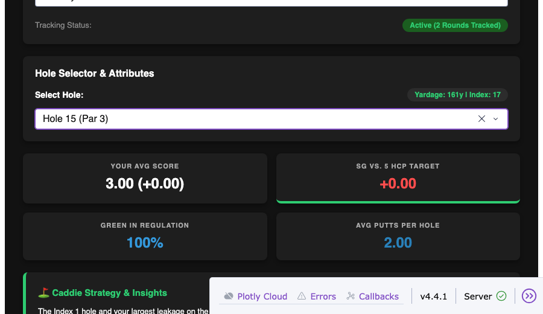

# DEF-002: Hole 15's par/index disagrees across the UI, depending which dataset a component reads

| | |
|---|---|
| **Status** | Not fixed — kept live intentionally as a reproducible finding from the autonomous QA agent |
| **Severity** | Low: cosmetic/data-consistency only, no data loss |
| **Component** | `fermoy_holes_raw` vs `fermoy_base_pars`/`fermoy_base_indices` in `golf_app_v8.py` — the app carries two separate hardcoded descriptions of Fermoy's hole layout that were never kept in sync |
| **Found** | 2026-09-23, by `qa_agent.py` autonomous exploration run `20260923-122122` (Claude Opus 5, 21 steps, $0.87) |
| **Reproducible at** | tag `demo/hole15-par-mismatch` (commit `23f0bffb` / `ac2d0ce`); still reproducible on `main` today, in a narrower form (see [Current state](#current-state-after-def-003)) |
| **Environment** | macOS, Python 3.12, Chromium (Playwright) |

## Summary

`golf_app_v8.py` describes Fermoy's 18 holes in two independent places that were never reconciled:

- `fermoy_holes_raw`: a fully static fallback dataset, used only when `data/fermoy_rounds.csv` has zero rows. It hardcodes Hole 15 as **Par 4, Index 1**.
- `fermoy_base_pars` / `fermoy_base_indices`: the arrays used to compute real stats once rounds exist. These correctly say Hole 15 is **Par 3, Index 17** (verified against Colin's physical scorecard — see [DEF-003](DEF-003-hardcoded-fermoy-stats.md)).

Both datasets feed different parts of the same screen, so which number you see for Hole 15 depends on which UI element you're looking at, not on anything about the hole itself.

## How it was found

`qa_agent.py` was given the goal "explore both tabs, interact with the dropdowns, check the page updates sensibly." On the Round Analysis tab it read the full page text (`get_text` on `#tabs-content`) and, unprompted, noticed the same hole described three different ways in one snapshot:

> "the hole dropdown lists 'Hole 15 (Par 3)' ... yet ... the BOTTLENECK card says 'Hole 15 (Index 1) -0.65 SG (442y Par 4)', and the caddie tip says 'At 442 yards, it's a par 5 for most'. A 442y hole cannot be a Par 3; par data is inconsistent across components."

This is the first (and so far only) defect this project's QA agent has found itself, rather than being found by a human reading test output — which is what the "Tier 3" autonomous agent in the README is meant to demonstrate.

## Steps to reproduce (as originally found)

```bash
git checkout demo/hole15-par-mismatch
python golf_app_v8.py
```

1. Open http://127.0.0.1:8050, Fermoy Golf Club selected by default.
2. Select **Hole 15** from the hole dropdown → the dropdown option itself reads "Hole 15 (Par 3)".
3. Look at the **BOTTLENECK** card in the course overview → "Hole 15 (Index 1) · -0.65 SG (442y Par 4)".
4. Read the Caddie Strategy tip for Hole 15 → "At 442 yards, it's a par 5 for most."

Three components, three different pars (3, 4, "5 for most") for the same hole in the same screen.

## Root cause

At the tagged commit, three independent sources described Hole 15:

1. `fermoy_holes_raw[14]`: `{"Par": 4, "Yards": 442, "Index": 1, ...}` — used for the Caddie Tip text always, and for everything else only when there's no CSV data.
2. `fermoy_base_pars[14]` / `fermoy_base_indices[14]`: `3` / `1` — used for the hole dropdown and header once real rounds exist.
3. A hardcoded string in `update_course_selection()`: `worst_details = "-0.65 SG (442y Par 4)"` — a human-typed figure for the BOTTLENECK card, unrelated to either array above.

Nobody had a mechanism keeping these three descriptions of the same hole consistent; they just each got typed once at different times.

## Current state (after DEF-003)

[DEF-003](DEF-003-hardcoded-fermoy-stats.md) fixed the *live* data path — `fermoy_base_pars`/`fermoy_base_indices`/`fermoy_base_yards` now match the real scorecard, and the hardcoded `worst_details` string was replaced with a value computed from real data. So source (3) above no longer exists, and the BOTTLENECK card no longer even shows Hole 15 (Hole 11 is now the real worst hole).

Per Colin's explicit decision, `fermoy_holes_raw` (source 1) was **deliberately left unfixed** so this remains a reproducible demo finding rather than being fixed away incidentally. The mismatch is now narrower but still real: the live header is correct, the caddie tip text is not.

```bash
python3 -c "
import golf_app_v8 as g
res = g.update_hole_analysis('Fermoy Golf Club', 15)
print(res[0])   # attr_tag
print(res[6])   # tip
"
```

```
Yardage: 161y | Index: 17
The Index 1 hole and your largest leakage on the course. At 442 yards, it's a par 5 for most. ...
```



## Fix

Not applied. If/when this is fixed, the correct move is to delete `fermoy_holes_raw` as a second source of truth for hole metadata (Par/Yards/Index/Tip) and derive the fallback purely from `fermoy_base_pars`/`fermoy_base_indices`/`fermoy_base_yards` plus a rewritten Hole 15 tip — one dataset, not two drifting in parallel. That also removes the need for anyone to remember to keep two arrays in sync by hand, which is what caused this in the first place.

## Not fixed / follow-ups

- `fermoy_holes_raw` disagrees with the live pars on 10 other holes too (see DEF-003's follow-ups) — only Hole 15 was ever surfaced as a defect, because it's the only one qa_agent happened to look at closely enough to notice the 442y/Par 3 contradiction.
- No regression test exists for this, intentionally — it's meant to stay reproducible as a QA-agent showcase, not be locked down by a test that would need deleting alongside `fermoy_holes_raw` later.
