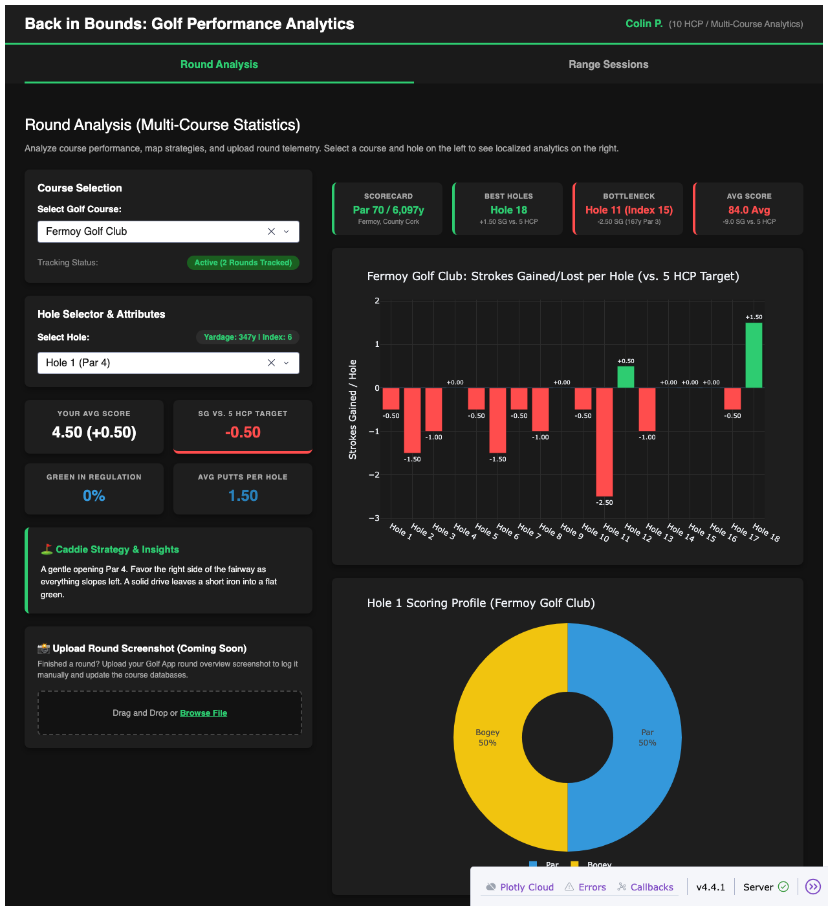

# DEF-003: Fermoy's "real data" stats were hardcoded and ignored the actual CSV

| | |
|---|---|
| **Status** | Fixed in `6114f0e` |
| **Severity** | Medium: no data loss, but the app's headline numbers for its one "real" course were fiction regardless of what was actually logged |
| **Component** | `COURSES_DB` and `update_course_selection()` in `golf_app_v8.py` |
| **Found** | 2026-09-24, while adding a second real round to `data/fermoy_rounds.csv` and noticing the summary cards didn't move |
| **Reproducible at** | commit `c923eec` (the code before the fix; no demo tag was cut for this one) |
| **Environment** | macOS, Python 3.12, Chromium (Playwright) |

## Summary

Fermoy Golf Club is the one course in `COURSES_DB` flagged `has_real_data: True`. The hole-by-hole Strokes Gained chart genuinely was computed from `data/fermoy_rounds.csv` (via `get_fermoy_aggregated_holes()`), but every number *above* that chart — the "Tracking Status" badge, Avg Score, Overall SG, Best Holes, and Bottleneck cards — was a fixed value sitting in the `COURSES_DB` dict and a couple of hardcoded strings in the callback. They never changed no matter what was actually in the CSV.

## Steps to reproduce

```bash
git show c923eec:golf_app_v8.py | grep -n '"status": "Active\|avg_score\|overall_sg\|best_holes\|worst_hole\|best_sg_str\|worst_details'
```

1. At `c923eec`, `data/fermoy_rounds.csv` had exactly 1 real round in it (23 Aug 2026, score 82).
2. Open the app, select Fermoy Golf Club on the Round Analysis tab.
3. The "Tracking Status" badge reads **"Active (114 Rounds Tracked)"** — there is no plausible way 1 logged round produces 114.

## Expected

The summary cards reflect whatever is actually in `data/fermoy_rounds.csv`: the round count, the real scoring average, and the real best/worst holes by Strokes Gained — the same source of truth already used by the chart underneath them.

## Actual

At `c923eec`, `COURSES_DB["Fermoy Golf Club"]` hardcoded:

```python
"status": "Active (114 Rounds Tracked)",
"best_holes": "Holes 4 & 16",
"worst_hole": "Hole 15 (Index 1)",
"avg_score": 81.3,
"overall_sg": -5.0
```

and `update_course_selection()` hardcoded the SG figures shown alongside Best Holes / Bottleneck:

```python
best_sg_str = "+0.05 SG vs. 5 HCP" if has_real else "Estimated Strengths"
worst_details = "-0.65 SG (442y Par 4)" if has_real else "Estimated Bottleneck"
```

None of these five values were derived from `data/fermoy_rounds.csv` at all — they'd show exactly the same thing whether the CSV had 0 rounds or 1,000.

## Root cause

`has_real_data: True` was being used purely to pick which *styling* branch to render (green "Active" badge and no warning banner) — it wasn't actually gating a computation against real data for these five fields. The chart below them (`get_course_holes_df` → `get_fermoy_aggregated_holes()`) did the real aggregation correctly; the summary cards next to it just never got wired to the same source.

## Fix

`6114f0e` adds `get_fermoy_round_count()` and, in `update_course_selection()`, derives all five values live when `has_real` is true:

```python
round_count = get_fermoy_round_count()
badge_text = f"Active ({round_count} Round{'s' if round_count != 1 else ''} Tracked)"
...
avg_score_str = f"{rounds_df['Total_Score'].mean():.1f} Avg"
overall_sg_str = f"{holes_df['SG'].sum():+.1f} SG vs. 5 HCP"
best_row = holes_df.loc[holes_df['SG'].idxmax()]
...
worst_row = holes_df.loc[holes_df['SG'].idxmin()]
```

With the 2 real rounds now logged (9 Aug: 86, 23 Aug: 82), the same screen shows:



`COURSES_DB["Fermoy Golf Club"]["status"]` is left as a plain `"Active"` fallback string with a comment noting it's unused while `has_real_data` is true, rather than deleting the field outright.

## Regression tests (`test_golf_app_v8.py`)

| Test | Guards against |
|---|---|
| `test_update_course_selection_callback` | Badge text reverting to a fixed string instead of `golf_app_v8.get_fermoy_round_count()` |

## Related fixes landed in the same commit

Two adjacent issues surfaced while fixing this one and were corrected alongside it (see the `6114f0e` commit message for the full diff):

- **Strokes Gained was labeled "vs 5 HCP" but computed vs scratch (par).** Every SG figure above — including the ones this defect is about — now applies a real 5-handicap stroke allocation (a stroke on the 5 hardest holes by index) rather than comparing straight to par.
- **The hole-by-hole metadata (`fermoy_base_pars`, `fermoy_base_indices`, `fermoy_base_yards`) didn't match Fermoy's real scorecard.** Par was already correct, but 16 of 18 stroke indices and all yardages were invented. Corrected from the real card (White tees); see [DEF-002](DEF-002-hole15-par-mismatch.md) for the one place a mismatch was deliberately left in place.

## Not fixed / follow-ups

- **`fermoy_holes_raw`** (the fallback dataset used only when the CSV has zero rows) still disagrees with the live `fermoy_base_pars` on 11 of 18 holes' par. It's currently dead code while real data exists, so it wasn't reconciled — see DEF-002.
- **The other 15 "Limited Data" courses** still show fully static estimated figures (explicitly labeled "Estimated Strengths" / "Estimated Bottleneck"), which is honest as-is but means this fix only applies to Fermoy.
